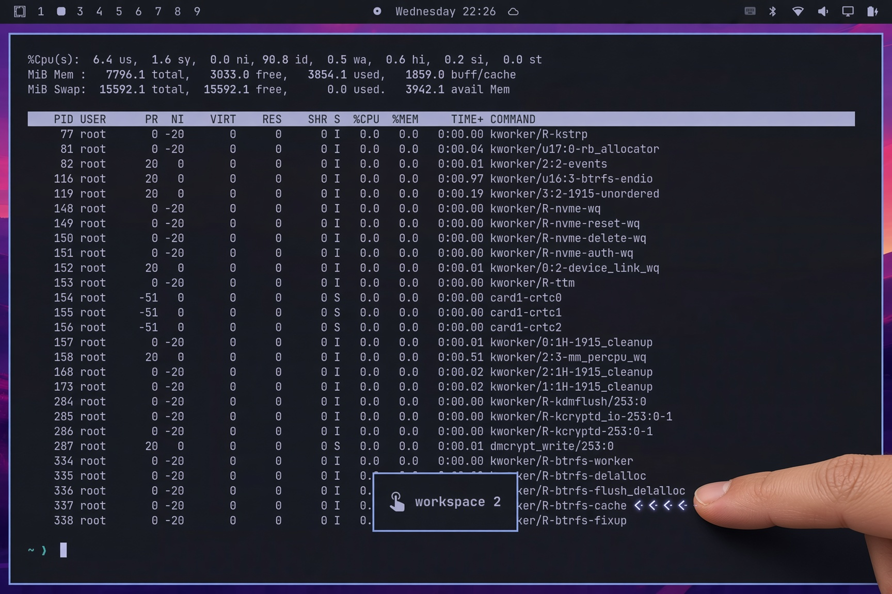
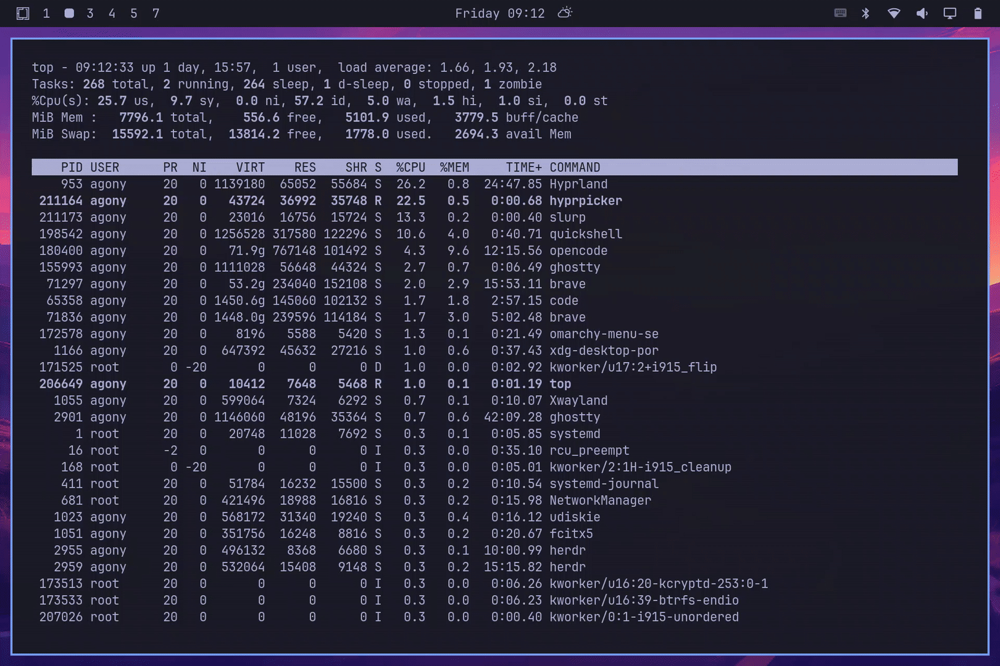

# Touch Swipe

[](https://github.com/rainan16/omarchy-workspace-touch-swipe/actions/workflows/ci.yml)

An [Omarchy](https://omarchy.org) plugin that switches Hyprland workspaces with one-finger edge swipes, and can show live previews of the workspace you land on.

No `input` group. No daemon. Layer-shell edge strips only.

Development status: Tested only on a Microsoft Surface Go 2 (SKU 1926, ELAN9038). Reports from other digitizers welcome.





## What it does

- one finger, left edge, swipe right → previous workspace
- one finger, right edge, swipe left → next workspace
- live workspace preview overlay after a swipe (OSD if overlay is off)

Idle edge strips stay ~4% wide so a swipe can be tracked, but only a slim outer hit band (~0.8% of width) takes input. Mouse clicks and hover reach app buttons (Chrome back, etc.). A touch on that hit band grabs the rest of the strip until release. Strips skip the bar exclusive zone (inset off a top/bottom bar; hidden on a left/right bar). While the overlay is open it still accepts edge swipes.

Two-finger swipes anywhere (needs the `input` group) are a separate plugin: [omarchy-workspace-touch-switch](https://github.com/rainan16/omarchy-workspace-touch-switch).

## Install

```sh
omarchy plugin add https://github.com/rainan16/omarchy-workspace-touch-swipe.git --enable
```

## Settings

Configure on the plugin entry in `~/.config/omarchy/shell.json` (hot-reloads on save):

```json
{ "id": "rainan16.workspace-touch-swipe" }
```

| Setting | Default | |
| --- | --- | --- |
| Live preview overlay | on | Live workspace previews after a swipe; skips OSD. `"overlay": false` turns it off. Preview windows use layout size (`width/scale`) so they fill the card on scaled displays. |
| OSD | on | The small `󰝁 workspace N` toast after a swipe. Skipped while overlay is on. `"osd": false` hides it when the overlay is also off. |

## Remove

```sh
omarchy plugin remove rainan16.workspace-touch-swipe
```

`omarchy plugin remove` deletes the plugin. Any leftover `"id": "rainan16.workspace-touch-swipe"` entry in `~/.config/omarchy/shell.json` is yours to remove.

## Development

Push and pull request to `main` run GitHub Actions: `node --test` (pass count on the run summary), and `qmllint` against Omarchy's `quattro` shell (`qs.Commons` / `qs.Ui`). `omarchy plugin validate` still needs a local Omarchy install.

PRs dry-run [semantic-release](https://github.com/semantic-release/semantic-release) (`--dry-run`, read-only). After CI passes on `main`, it tags `vX.Y.Z`, writes a GitHub Release, and bumps `manifest.json` (plugin version). Use Conventional Commits (`feat:`, `fix:`, `BREAKING CHANGE`); `chore:` does not bump.

Tests, QML cache, and other gotchas are in [AGENTS.md](AGENTS.md).

A version supporting a `two-finger switch` anywhere on the screen also available `omarchy-workspace-touch-switch`. But this needs  permissions to access the touch screen and some extra C code.

## License

MIT
